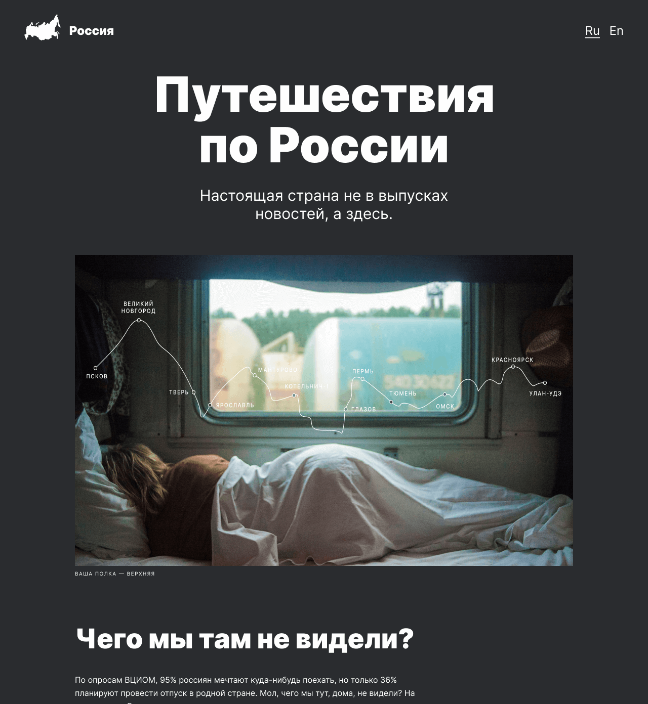

# Путешествие по России

#### *Проект рассказывает о достопримечательностях России и дает рекомендации для путешествий*
link: https://vgaidukov.github.io/russian-travel/

Здесь вы узнаете краткую информацию о самых живописных местах, а также некоторые факты в цифрах о нашей стране.
Ссылки на дополнительные ресурсы позволят подробнее изучить интересующее направление.

## Содержание проекта:
 1. Схема ж/д маршрута Псков - Улан-Удэ
 2. Факты в цифрах
 3. Фото живописных мест
 4. Описание туристических направлений 
 5. Ссылка на фотоотчет о путешествии до Байкала
 6. Полезные ресурсы

 ## Автор проекта:

 #### Вадим Гайдуков
 Проект реализован в рамках обучения на [Яндекс.Практикум](https://practicum.yandex.ru/) с применением следующих технологий:
 - флексбокс-верстка
 - grid-layout
 - позиционирование
 - анимация
 - адаптивная верстка, медиазапросы
 - структурирование проекта по правилам Nested БЭМ

 ## Preview :
 
 
